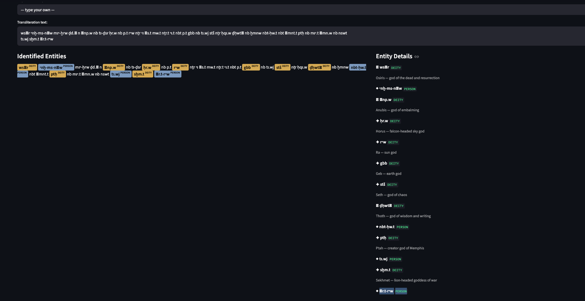

# Egyptian Transliteration NER

The first NER model trained directly on ancient Egyptian transliteration text. Identifies deities and persons in Leiden Unified Transliteration without any English translation.

**Live Demo:** https://juhi-egyptian-transliteration-ner.streamlit.app/

**Paper:** https://doi.org/10.5281/zenodo.19800720

## Overview

Most computational work on ancient Egyptian texts relies on English translations. This project works directly on the source language as Egyptologists write it: Leiden Unified Transliteration (e.g., `wsꞽr`, `ḥr.w`, `ꞽnp.w`).

Trained on 7,059 sentences from the Thesaurus Linguae Aegyptiae corpus, the model achieves 95.6% F1 identifying DEITY and PERSON entities in Middle Egyptian transliteration.

## Results

| Metric | Score |
|---|---|
| F1 | 95.6% |
| Precision | 96.0% |
| Recall | 95.3% |
| Training sentences | 7,059 |
| Validation sentences | 1,412 |
| Entity classes | DEITY, PERSON |

## Demo



## Example

Input:
```
wsꞽr nb ꜣbḏw ḏd.ꞽn rꜥw n wsꞽr stš ḫft.ꞽ n ḥr.w ꞽnp.w tp-ḏw=f
```

Output:
```
[DEITY] wsꞽr      — Osiris
[DEITY] rꜥw       — Ra
[DEITY] wsꞽr      — Osiris
[DEITY] stš       — Seth
[DEITY] ḥr.w      — Horus
[DEITY] ꞽnp.w     — Anubis
```

## Dataset

**Source:** Thesaurus Linguae Aegyptiae (TLA), Berlin-Brandenburg Academy of Sciences
**HuggingFace:** `thesaurus-linguae-aegyptiae/tla-Earlier_Egyptian_original-v18-premium`
**Period:** Middle Egyptian (ca. 2180–1539 BCE)
**Total sentences:** 12,773
**Fields:** hieroglyphs, transliteration, lemmatization, UPOS, glossing, German translation, dating

## Method

Training data was generated automatically using the UPOS field in the TLA corpus. Tokens tagged as `PROPN` (proper noun) were labeled as entities. Known deity names were assigned the `DEITY` label; remaining proper nouns were assigned `PERSON`.

This removes the need for manual annotation while leveraging the expert linguistic tagging already present in the TLA corpus.

## App Features

- **Single Text mode** - enter any transliteration text, get highlighted entity annotations with deity descriptions
- **Batch Analysis mode** - paste multiple sentences, get entity frequency counts across the corpus

## Research Context

This project is part of broader computational Egyptology work including:
- NER on Book of the Dead entities (English)
- Hieroglyph sign classification (ResNet-50, 91.8% accuracy)
- DemonThings knowledge graph integration

The next step is extending the entity taxonomy to include DEMON, LOCATION, and RITUAL classes using the DemonThings/DemonBase corpus (Scalf et al., Oriental Institute).

## Stack

- spaCy (language-agnostic NER)
- Thesaurus Linguae Aegyptiae corpus
- Streamlit (demo interface)
- HuggingFace Datasets

## References

- Thesaurus Linguae Aegyptiae. Berlin-Brandenburg Academy of Sciences and Humanities. https://tla.digital
- Scalf, F. et al. DemonThings: Ancient Egyptian Demonology Project. Oriental Institute, University of Chicago. https://voices.uchicago.edu/demonthings/
- Sartini, B. & Lucarelli, R. (2024). Towards a Semantic Representation of Egyptian Demonology. SemDH Workshop.
